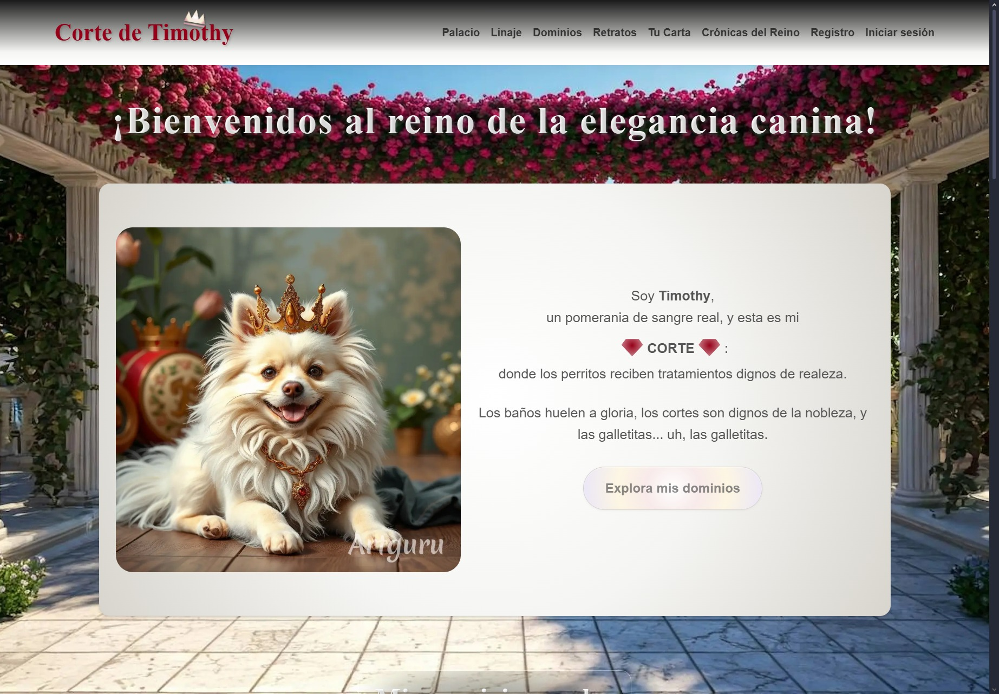
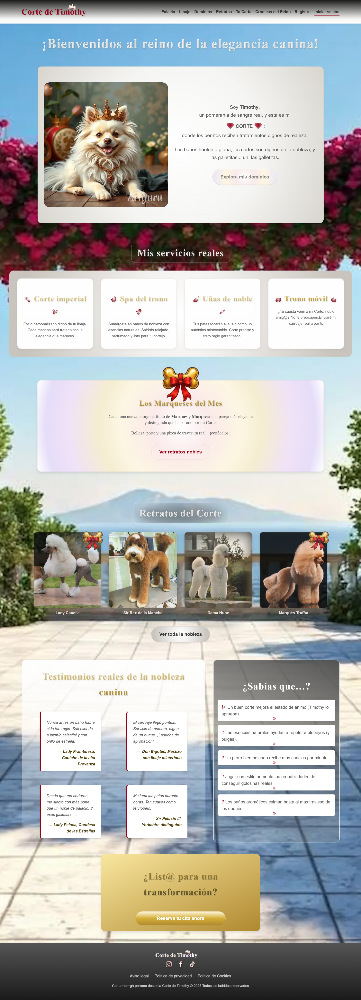
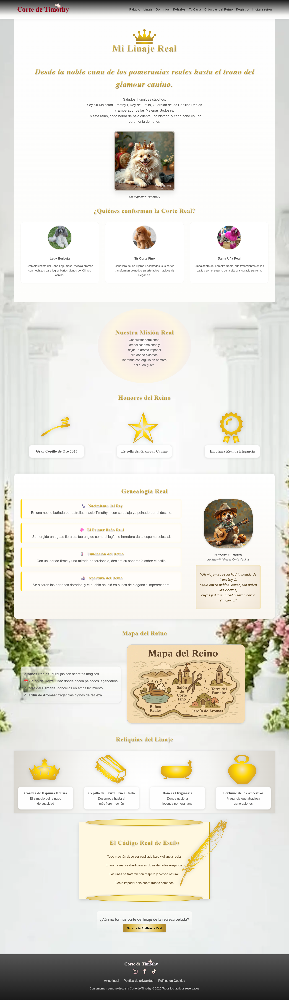
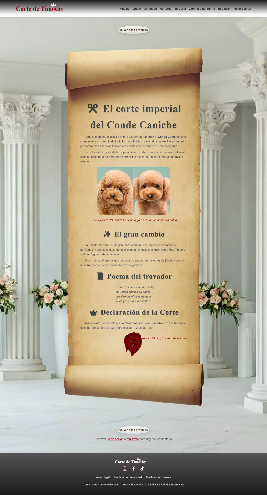

 

<h1 align="center"> 👑 Corte de Timothy </h1>

 

    

 

 

  

🇪🇸 Un proyecto académico realizado en **WordPress + PHP**, donde Timothy, un perro pomerania, es el **rey y anfitrión** de un salón de estética canina.  
En este reino mágico, todos los pequeños peludos son tratados como nobleza.

🐾 **Sir Pelusín**, el trovador, narra las historias del linaje real y las crónicas del reino.

---

🇬🇧 An academic project built in **WordPress + PHP**, where Timothy, a Pomeranian dog, is the **king and host** of a dog grooming salon.  
In this magical kingdom, all little furry friends are treated as nobility.

🐾 **Sir Pelusín**, the bard, narrates the stories of the royal lineage and the kingdom's chronicles.

 

## 🌍 Demo / Online demo
👉 [Corte de Timothy](https://corte-timothy.infy.uk/)

 

## ✨ Características / Features
- 🐕 Tema **propio y personalizado** en WordPress  
  / Custom WordPress theme  
- 🎭 Ambientación fantástica y narrativa con personajes (Timothy & Sir Pelusín)  
  / Fantasy setting with narrative and characters  
- 📜 Páginas destacadas:  
  - **Linaje real (Quiénes somos)** → Historia del reino  
    / Royal lineage (About us) → Kingdom history  
  - **Crónicas del reino (Blog)** → Narradas por el trovador  
    / Kingdom chronicles (Blog) → Narrated by the bard  
  - **Dominios** → Servicios para los peludos nobles  
    / Domains → Services for noble pets  
  - **Retratos** → Galería real  
    / Portraits → Royal gallery

 

## ⚙️ Stack técnico / Tech stack
- **Código PHP** → desarrollo de tema propio / Custom PHP theme development  
- **Estilos** → SASS/CSS / Styles → SASS/CSS  
- **Scripts** → JavaScript propio / Custom JavaScript  
- **Plantillas y funciones personalizadas / Templates and custom functions**  
- **Tema personalizado**: `corte-de-timothy` / Custom theme: `corte-de-timothy`
  
 

## 🔌 Plugins utilizados / Plugins used
- [Advanced Custom Fields (ACF)](https://www.advancedcustomfields.com/)  
- [Site Reviews](https://wordpress.org/plugins/site-reviews/)  
- [Simply Schedule Appointments](https://simplyscheduleappointments.com/)  
- **Propios / Custom**:
  - Antispam  
  
 

## 🖼️ Capturas de pantalla / Screenshots

  
🏰 Página principal / Home page

  
  

  
📜 Linaje real / Royal lineage

  
  

  
✒️ Crónica del reino / Kingdom chronicle

  
  

  

✍️ Proyecto desarrollado para la asignatura de **PHP/WordPress**. 
 / Academic project for the **PHP/WordPress** course.

 

## 📫 Contacto/ Contact

     